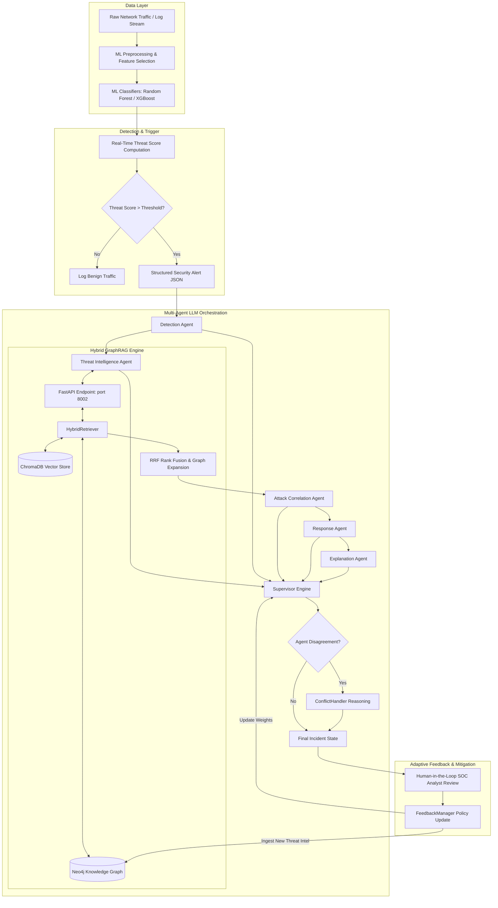
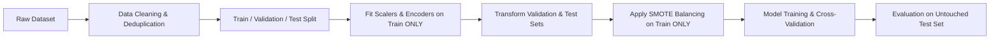
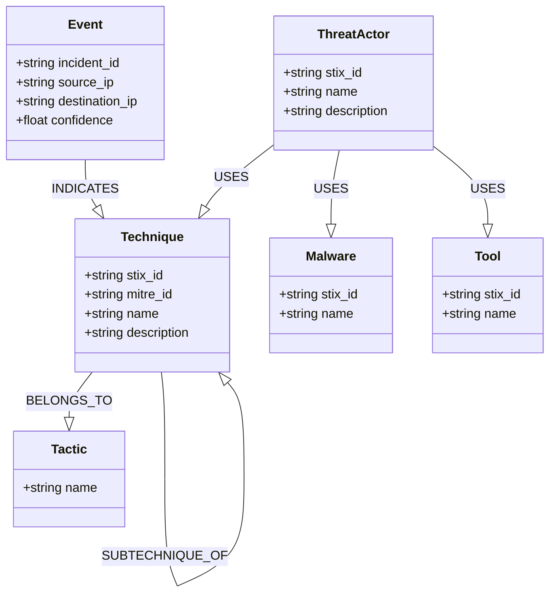

# Adaptive Multi-Agent Cyber Defence Using GraphRAG and Large Language Models for Explainable Real-Time Threat Intelligence


### Authors
1. **ANUSMITA RAY CHAUDHURI**
2. **ABIR PRAMANICK**
3. **ANIRBAN RAY**

- **Institution**: JIS COLLEGE OF ENGINEERING, Kalyani, West Bengal, India, 741235
- **Department**: Computer Science and Engineering
- **Course / Program**: CSE
- **Academic Year**: 2023-27
- **Contact**:
  - titirray05@gmail.com
  - abirpramanick1@gmail.com
  - anirbanmark1429@gmail.com

---

## Executive Summary & System Overview

Modern enterprise network environments face an escalating volume of sophisticated, low-and-slow cyber attacks that easily evade traditional static rule-based Intrusion Detection Systems (IDS). While modern Machine Learning (ML) classifiers offer high-speed telemetry anomaly detection, they inherently lack contextual understanding—failing to explain *why* a flow is malicious or *how* it maps to known threat actor tactics. Conversely, Large Language Models (LLMs) possess deep reasoning capabilities but suffer from hallucinations when isolated from structured security context.

This project implements an **Adaptive Multi-Agent Cyber Defense** framework that bridges low-level network flow classification with high-level threat reasoning. The architecture couples ML-based threat detection (Random Forest & XGBoost), structured Knowledge Graph expansion via **GraphRAG** (combining ChromaDB vector similarity with Neo4j STIX/MITRE ATT&CK graph topologies), and a multi-agent LLM orchestration engine powered by Google Gemini.

### Implementation Status Matrix
To preserve strict scientific integrity, this documentation demarcates currently functional modules from ongoing and proposed research features:

| Component | Status | Details |
| :--- | :--- | :--- |
| **ML Threat Detection Pipeline** | ✅ **IMPLEMENTED** | Offline training, feature reduction, leakage audit, and scoring on CSE-CIC-IDS2018 (`02-14-2018.csv`) & TON_IoT datasets. |
| **ChromaDB Semantic Vector Store** | ✅ **IMPLEMENTED** | Persistent vector store using `all-MiniLM-L6-v2` embeddings over MITRE ATT&CK technique descriptions. |
| **Neo4j Knowledge Graph Integration** | ✅ **IMPLEMENTED (OFFLINE FALLBACK ACTIVE)** | STIX 2.1 / MITRE ATT&CK schema loader, dump importer, and automatic graceful fallback to vector search when Neo4j is offline. |
| **Hybrid GraphRAG Retriever** | ✅ **IMPLEMENTED** | Reciprocal Rank Fusion (RRF) combining ChromaDB semantic search and Neo4j Cypher graph queries. |
| **Multi-Agent LLM Orchestration** | ✅ **IMPLEMENTED** | 5 specialized agents (`Detection`, `ThreatIntel`, `Correlation`, `Response`, `Explanation`), `Supervisor`, `ConflictHandler`, and `FeedbackManager`. |
| **FastAPI Service Endpoints** | ✅ **IMPLEMENTED** | GraphRAG API server listening on port `8002` (`graph/api/graph_api.py`) and Agents API on port `8000`. |
| **Live Streaming Packet Ingestion** | 🚧 **UNDER DEVELOPMENT** | Currently evaluates static CSV/JSON alert streams; live eBPF/Suricata socket ingest is under active development. |
| **Automated Active Mitigation** | 🔮 **PROPOSED / FUTURE** | Recommends defensive policies with Human-in-the-Loop (HITL) approval prior to execution. |

---

## Research Novelty

Unlike existing solutions that apply RAG or LLMs in isolation, this work introduces an end-to-end feedback-driven threat intelligence pipeline. The primary research contributions include:

1. **Deterministic-to-Agentic Handshake**: Low-latency ML classifiers score raw network flows ($<0.02\text{ ms/sample}$) and trigger agentic LLM reasoning only when threat thresholds are exceeded, optimizing computational cost.
2. **Context-Grounded GraphRAG**: Combines lexical Cypher queries over STIX 2.1 graph nodes (Techniques, Threat Actors, Malware, Tools, Campaigns) with ChromaDB dense vector embeddings using Reciprocal Rank Fusion (RRF).
3. **Structured Multi-Agent Reasoning**: Eliminates single-prompt bottlenecking by distributing tasks across specialized agents:
   - **Detection Agent**: Normalizes raw security telemetry into verifiable observed evidence.
   - **Threat Intelligence Agent**: Queries GraphRAG to retrieve external MITRE ATT&CK context.
   - **Attack Correlation Agent**: Maps observed evidence onto multi-hop attack paths and kill chain stages.
   - **Response Agent**: Recommends containment actions under strict Human-in-the-Loop constraints.
   - **Explanation Agent**: Synthesizes human-readable SOC analyst reports detailing confidence and limitations.
4. **Disagreement & Adaptive Policy Management**: Incorporates a `ConflictHandler` to resolve inter-agent contradictions and a `FeedbackManager` to update adaptive policy weights based on analyst confirmation.

> **Academic Attribution**: This project builds upon foundational concepts established in multi-agent cyber defense literature (e.g., MALCDF framework) and RAG-based Cyber Threat Intelligence (e.g., RAGRecon). The novelty resides in the tight integration of ML event scoring, hybrid graph-vector retrieval, and adaptive policy feedback.

---

## Complete System Architecture



---

## Current Machine Learning Pipeline

The ML detection layer ingests high-dimensional network flow statistics and outputs threat probabilities.

### 1. Dataset 1 — CSE-CIC-IDS2018 (`02-14-2018.csv`)
- **Source**: Canadian Institute for Cybersecurity (CIC) / Communications Security Establishment (CSE).
- **Scope**: Evaluated on `02-14-2018.csv` (1,048,575 raw records).
- **Classes**: `Benign` (662,458), `SSH-Bruteforce` (117,322), `FTP-BruteForce` (39,346).
- **Preprocessing**: Removed 225,628 duplicates, 3,821 missing/infinite rows, 14 redundant correlated features, and 1 target leakage feature (`Dst Port`). Final shape: `(819,126, 65)`.
- **Top Predictive Features**: `Fwd Seg Size Min` (15.5%), `Init Fwd Win Byts` (8.37%), `Bwd Pkts/s` (6.91%), `Fwd Act Data Pkts` (5.81%).

### 2. Dataset 2 — TON_IoT (`Train_Test_Network.csv`)
- **Source**: Cyber Range Lab of UNSW Canberra Cyber.
- **Scope**: Evaluated on `Train_Test_Network.csv` (461,043 raw records).
- **Classes (10 multi-class targets)**: `normal`, `scanning`, `dos`, `injection`, `ddos`, `password`, `xss`, `ransomware`, `backdoor`, `mitm`.
- **Preprocessing**: Removed 11,071 duplicate rows and 2 redundant correlated features. Final shape: `(449,972, 43)`.

> [!WARNING]
> **METHODOLOGICAL NOTICE (TON_IoT Target Leakage)**: Initial exploratory scripts identified a potential target leakage issue where the binary `label` column (0/1) was present alongside the multi-class target `type`. Before utilizing TON_IoT benchmark figures in published literature, verify that `label` is strictly excluded from input feature matrices.

---

## ML Preprocessing Guide & Research-Safe Workflow

To prevent data leakage during model training and evaluation, adhere strictly to the research-safe preprocessing pipeline:



### Recommended Workflow Rules
1. **Split First**: Execute `train_test_split` prior to any normalization or imputation.
2. **Train-Only Fitting**: Fit `StandardScaler`, `MinMaxScaler`, and `OneHotEncoder` strictly on the training partition (`X_train`).
3. **No Leakage Transmutations**: Transform validation (`X_val`) and test (`X_test`) using training parameters.
4. **Resampling Scope**: Apply SMOTE or random oversampling exclusively to `X_train`.

---

## Machine Learning Models & Evaluation

Three baseline classifiers were trained and evaluated across both datasets:

| Dataset | Model | Training Time (s) | Inference Latency (ms/sample) | Accuracy | Precision | Recall | Weighted F1 | **Macro F1** |
| :--- | :--- | :---: | :---: | :---: | :---: | :---: | :---: | :---: |
| **CIC-IDS2018** | Logistic Regression | 6.41 s | 0.00023 ms | 0.9995 | 0.9995 | 0.9995 | 0.9995 | **0.9990** |
| **CIC-IDS2018** | **Random Forest** | 210.32 s | 0.00789 ms | **1.0000** | **1.0000** | **1.0000** | **1.0000** | **1.0000** |
| **CIC-IDS2018** | XGBoost | 71.44 s | 0.00752 ms | 1.0000 | 1.0000 | 1.0000 | 1.0000 | **1.0000** |
| **TON_IoT** | Logistic Regression | 1272.78 s | 0.00025 ms | 0.9871 | 0.9879 | 0.9871 | 0.9871 | **0.9695** |
| **TON_IoT** | Random Forest | 595.11 s | 0.02234 ms | 0.9999 | 0.9999 | 0.9999 | 0.9999 | **0.9998** |
| **TON_IoT** | **XGBoost** | 485.77 s | 0.02362 ms | **1.0000** | **1.0000** | **1.0000** | **1.0000** | **1.0000** |

> **Why Macro F1 Matters**: In imbalanced cybersecurity datasets (where benign traffic accounts for >80% of total volume), accuracy and weighted F1 are heavily biased by the majority class. Macro F1 computes unweighted mean metrics across all classes, ensuring minority attacks (such as MITM or FTP-Bruteforce) are evaluated equally.

---

## Data Leakage & Experimental Validity

### Leakage Audit Findings
1. **Destination Port (`Dst Port`) Leakage**: Single-feature diagnostic revealed `Dst Port` alone achieved 99.95% predictive accuracy on CSE-CIC-IDS2018. This was an artifact of automated attack scripts hitting fixed ports (`21` for FTP, `22` for SSH). `Dst Port` was permanently removed from the feature space.
2. **`Fwd Seg Size Min` Inspection**: Achieved 99.65% standalone accuracy post-leakage fix. While valid, it reflects synthetic traffic generator characteristics (Engelen et al., 2021).
3. **Generalization Caution**: High in-dataset F1 scores (1.0000) reflect synthetic lab control rather than operational enterprise resilience. Cross-dataset evaluation is strongly recommended for future extensions.

---

## Google Colab — Complete ML Training Tutorial

Follow this step-by-step guide to reproduce model training in Google Colab:

### Step 1 — Open Google Colab & Enable Hardware Acceleration
1. Navigate to [Google Colab](https://colab.research.google.com/).
2. Select **File → New Notebook**.
3. Go to **Runtime → Change runtime type** and select **T4 GPU** or high-RAM CPU.

### Step 2 — Clone Repository & Install Dependencies
```python
!git clone https://github.com/anus05/Adaptive-Multi-Agent-Cyber-Defense.git
%cd Adaptive-Multi-Agent-Cyber-Defense
!pip install -r requirements.txt
```

### Step 3 — Secure Kaggle Dataset Acquisition
Set up Kaggle API credentials using Colab Secrets (do not hardcode keys):
```python
import os
from google.colab import userdata

os.environ['KAGGLE_USERNAME'] = userdata.get('KAGGLE_USERNAME')
os.environ['KAGGLE_KEY'] = userdata.get('KAGGLE_KEY')

!kaggle datasets download -d solarmonkey/cse-cic-ids2018 -p "ML Data/dataset" --unzip
```

### Step 4 — Run Training & Artifact Generation
Execute the main notebook cells in `ML Data/Cyber_Defense_Framework_Using_GraphRAG.ipynb` to clean data, train models, and export serialized model files (`.joblib`).

---

## Repository Requirements Manifest (`requirements.txt`)

The root `requirements.txt` specifies all required packages across modules:

```text
# Core LLM Integration & Orchestration
google-genai==2.24.0
python-dotenv==1.2.2
fastapi==0.135.1
pydantic==2.12.5
uvicorn==0.41.0
pytest==9.1.1

# Graph Database & Vector Database
neo4j==5.28.1
chromadb==0.6.3
sentence-transformers==3.4.1

# Machine Learning & Data Processing
pandas>=2.0.0
numpy>=1.24.0
scikit-learn>=1.3.0
imbalanced-learn>=0.11.0
xgboost>=2.0.0
joblib>=1.3.0

# Visualization & Utilities
matplotlib>=3.7.0
seaborn>=0.12.0
kaggle>=1.5.0
```

---

## Neo4j Knowledge Graph Setup Guide

The GraphRAG engine relies on Neo4j for multi-hop graph traversals.

### Option A — Neo4j Desktop (Local Setup)
1. Download and install [Neo4j Desktop](https://neo4j.com/download/).
2. Create a new Project named `CyberDefense`.
3. Add a Local DBMS with:
   - **Version**: `5.x`
   - **Password**: `anirban997` (or custom password updated in `.env`)
4. Start the database instance.
5. Verify Bolt port accessibility at `bolt://localhost:7687`.

### Option B — Neo4j AuraDB (Cloud Setup)
1. Create a free instance at [Neo4j AuraDB](https://neo4j.com/cloud/platform/auradb/).
2. Save your Connection URI (`neo4j+s://xxx.databases.neo4j.io`) and password.
3. Update your `.env` configuration file accordingly.

### Environment Variable Configuration (`.env`)
Create a `.env` file at the root of the project:
```env
NEO4J_URI=bolt://localhost:7687
NEO4J_USERNAME=neo4j
NEO4J_PASSWORD=YOUR_SECURE_PASSWORD
NEO4J_DATABASE=neo4j
```

---

## Neo4j Python Connection Verification

Verify Neo4j connectivity using the included helper script:

```bash
python scripts/test_neo4j_connection.py
```

### Expected Output
```text
Connecting to Neo4j at bolt://localhost:7687 (Database: neo4j)...
[OK] Neo4j connection successful!
Total Nodes in Knowledge Graph: 2085
```
*(Note: If Neo4j is offline, `GraphRetriever` automatically logs a warning and switches to ChromaDB vector-only fallback mode).*

---

## Knowledge Graph Schema

The cybersecurity knowledge graph structures STIX 2.1 entities and MITRE ATT&CK concepts:



---

## Cypher Query Cheat Sheet

```cypher
// 1. Query all techniques associated with a Threat Actor
MATCH (a:ThreatActor {name: "APT29"})-[:USES]->(t:Technique)
RETURN a.name, t.mitre_id, t.name;

// 2. Find 3-hop attack paths originating from a specific technique
MATCH path = (start:Technique {mitre_id: "T1059"})-[*1..3]->(target)
RETURN path LIMIT 25;

// 3. Count total graph nodes by label
MATCH (n)
RETURN labels(n) AS Label, count(n) AS Count;
```

---

## GraphRAG Engine & Hybrid Retrieval

GraphRAG combines vector similarity search with graph topology traversal:

```text
User / Alert Query
       │
       ├──> ChromaDB Vector Store (Semantic Top-K) ──┐
       │                                            ├──> RRF Rank Fusion ──> Graph Expansion (3-Hop) ──> Grounded Prompt Context
       └──> Neo4j Lexical Cypher Search ────────────┘
```

### Concept Comparison: Vector RAG vs. GraphRAG

| Feature | Standard Vector RAG | Hybrid GraphRAG (This Project) |
| :--- | :--- | :--- |
| **Retrieval Mechanism** | Top-K cosine distance over text chunks | Reciprocal Rank Fusion over vector similarity + Cypher graph paths |
| **Context Scope** | Unstructured document snippets | Structured STIX entities, ATT&CK tactics, and multi-hop attack paths |
| **Multi-Hop Reasoning** | Poor (requires manual chunk stitching) | Excellent (native graph traversal up to 3 hops) |
| **Hallucination Control**| Moderate | Strict (grounded in verified graph edges) |

---

## LLM Provider Configuration

Configure LLM provider credentials in `LLM integration/.env`:

```env
GEMINI_API_KEY=YOUR_GEMINI_API_KEY
GEMINI_MODEL=gemini-3.6-flash
```

The system uses `google-genai==2.24.0` with built-in exponential backoff for `429 RESOURCE_EXHAUSTED` and `503 Service Unavailable` errors (`LLM integration/models/llm_client.py`).

---

## Multi-Agent Architecture

```text
Alert Payload
     │
     ▼
Detection Agent ──> Threat Intelligence Agent ──> GraphRAG API ──> Attack Correlation Agent ──> Response Agent ──> Explanation Agent
                                                                                                                           │
                                                                                                                           ▼
                                                                                                                   ConflictHandler
                                                                                                                           │
                                                                                                                           ▼
                                                                                                                    FeedbackManager
```

- **Detection Agent**: Parses raw alert, extracts entities (`IP`, `port`, `protocol`), outputs observed evidence.
- **Threat Intelligence Agent**: Queries `POST /api/graphrag/query` on port 8002 to fetch grounded ATT&CK evidence.
- **Attack Correlation Agent**: Identifies multi-stage attack chains and maps tactics.
- **Response Agent**: Formulates mitigation strategies (containment, isolation, monitoring) requiring Human-in-the-Loop approval.
- **Explanation Agent**: Generates human-readable SOC analyst reports with confidence scores and limitations.
- **Supervisor & ConflictHandler**: Evaluates inter-agent disagreements and adjusts final confidence.

---

## Real-Time Threat Scoring Formula

Events are scored using a weighted hybrid score combining ML classifier confidence and rule-based severity:

$$\text{Threat Score} = 0.8 \times S_{\text{ML}} + 0.2 \times S_{\text{Rule}}$$

Where:
- $S_{\text{ML}}$ = Probability output from Random Forest / XGBoost ($0.0 \text{ to } 1.0$).
- $S_{\text{Rule}}$ = Rule-based weight derived from failed attempt counts, sensitive port access, and protocol risk.

### Severity Mapping
- **Critical**: $\text{Threat Score} \ge 0.85$
- **High**: $0.70 \le \text{Threat Score} < 0.85$
- **Medium**: $0.50 \le \text{Threat Score} < 0.70$
- **Low**: $\text{Threat Score} < 0.50$

---

## Testing & System Verification

### 1. Execute Offline Agent Validation Tests
```bash
cd "LLM integration"
python run_phase4_tests.py
```
*(Runs 35 unit tests verifying agent validators, prompt formats, and JSON schemas).*

### 2. Execute LLM Client Retry & Rate-Limit Tests
```bash
python run_fix3_tests.py
```
*(Runs 10 tests verifying exponential backoff for 429/503 HTTP status codes).*

### 3. Test Isolated ChromaDB Vector Store
```bash
python -m graph.retrieval.vector_store
```

### 4. Test GraphAgent in Fallback Mode
```bash
python -m graph.agent.graph_agent
```

### 5. Start GraphRAG API Service (Port 8002)
```bash
python -m uvicorn graph.api.graph_api:app --host 127.0.0.1 --port 8002
```

### 6. Run End-to-End Pipeline Verification
```bash
cd "LLM integration"
python evaluation/end_to_end_test.py
```

---

## Verification & Output Checklist

- [x] **ML Verification**: Model outputs valid class probabilities and feature importance charts.
- [x] **Vector Store Verification**: ChromaDB returns top-5 semantic matches for ATT&CK queries.
- [x] **GraphRAG API Verification**: `http://127.0.0.1:8002/health` returns `{"status": "healthy"}`.
- [x] **Agent Pipeline Verification**: All 5 agents execute sequentially, managing state via `AgentState`.

---

## Project Directory Layout

```text
Adaptive-Multi-Agent-Cyber-Defense/
├── .env                              # Root environment file (Neo4j settings)
├── LICENSE.md                        # MIT License & Third-Party Notices
├── Readme.md                          # Main project guide & documentation
├── requirements.txt                  # Consolidated Python dependencies
│
├── ML Data/                          # ML Detection Pipeline (Member 1)
│   ├── Cyber_Defense_Framework_Using_GraphRAG.ipynb
│   ├── dataset/                      # CSE-CIC-IDS2018 & TON_IoT datasets
│   └── sample-result/                # Model evaluation metrics & charts
│
├── graph/                            # Knowledge Graph & GraphRAG (Member 2)
│   ├── agent/                        # GraphAgent & Evidence Compressor
│   ├── api/                          # FastAPI server (graph_api.py on port 8002)
│   ├── evaluation/                   # Retrieval quality evaluators
│   ├── ingestion/                    # STIX/TAXII/MITRE/NVD data loaders
│   ├── neo4j/                        # Neo4j database scripts & loader
│   └── retrieval/                    # HybridRetriever & VectorStore
│
├── LLM integration/                  # Multi-Agent Orchestration (Member 3)
│   ├── .env                          # Gemini API credentials
│   ├── agents/                       # 5 specialized agent implementations
│   ├── api/                          # FastAPI server (agents_api.py on port 8000)
│   ├── evaluation/                   # End-to-end integration test harness
│   ├── feedback/                     # FeedbackManager & policy updater
│   ├── models/                       # Gemini LLM client with backoff
│   ├── orchestration/                # AgentState, ConflictHandler, Supervisor
│   └── results/                      # Output JSON results
│
└── scripts/                          # Project utility scripts
    └── test_neo4j_connection.py      # Neo4j connection tester
```

---

## Research Limitations

1. **Synthetic & Lab Dataset Bias**: Benchmark models trained on CSE-CIC-IDS2018 and TON_IoT reflect controlled network artifacts. Performance on live enterprise traffic may experience distribution shift.
2. **API Quota Constraints**: Live multi-agent execution depends on external LLM provider quotas (`gemini-3.6-flash` free-tier is limited to 20 requests/day).
3. **Offline Graph DBMS Fallback**: When local Neo4j database service is offline, GraphRAG automatically degrades to vector-only search.
4. **Heuristic Rule Weights**: Threat scoring weights ($0.8 \times \text{ML} + 0.2 \times \text{Rules}$) represent expert design parameters rather than end-to-end backpropagated weights.

---

## Reproducibility Checklist

- [ ] Clone repository: `git clone https://github.com/anus05/Adaptive-Multi-Agent-Cyber-Defense.git`
- [ ] Create Python virtual environment: `python -m venv .venv`
- [ ] Activate environment (`.venv\Scripts\activate` on Windows or `source .venv/bin/activate` on Linux/macOS)
- [ ] Install dependencies: `pip install -r requirements.txt`
- [ ] Configure root `.env` and `LLM integration/.env`
- [ ] Verify Neo4j connection: `python scripts/test_neo4j_connection.py`
- [ ] Launch GraphRAG API: `python -m uvicorn graph.api.graph_api:app --host 127.0.0.1 --port 8002`
- [ ] Execute End-to-End test: `python "LLM integration/evaluation/end_to_end_test.py"`

---

## Environment Setup Instructions

### Windows (PowerShell)
```powershell
python -m venv .venv
.\.venv\Scripts\Activate.ps1
pip install -r requirements.txt
```

### Linux / macOS (Bash/Zsh)
```bash
python3 -m venv .venv
source .venv/bin/activate
pip install -r requirements.txt
```

---

## Common Errors & Troubleshooting

| Error | Root Cause | Solution |
| :--- | :--- | :--- |
| `WinError 10061 / ConnectionRefusedError` | Neo4j service is not running on port `7687`. | Start Neo4j Desktop DBMS instance. System automatically falls back to vector search. |
| `429 RESOURCE_EXHAUSTED` | Exceeded Gemini free-tier quota (20 req/day). | Wait for daily quota reset or supply a paid API key in `LLM integration/.env`. |
| `ModuleNotFoundError: No module named 'orchestration'` | Python path missing project root directory. | Run scripts using `python -m` or execute via `end_to_end_test.py` with `sys.path` patch. |
| `UnicodeEncodeError: 'charmap'` | Windows console cp1252 character mapping issue with emojis. | Replace emoji strings with ASCII text or run `chcp 65001` in PowerShell. |

---

## Security Best Practices

1. **Credential Isolation**: Never commit `.env` files or API keys. Verify `.gitignore` contains `.env` and `*.env`.
2. **Human-in-the-Loop (HITL)**: Defensive recommendations generated by `ResponseAgent` are marked `recommendation_only` and require explicit SOC analyst verification before execution.
3. **Least Privilege Access**: Configure Neo4j database credentials with read-only privileges for retrieval components.

---

## Citation & References

### BibTeX Placeholder
```bibtex
@incollection{adaptive_multiagent_cyberdefense_2026,
  title     = {Adaptive Multi-Agent Cyber Defence Using GraphRAG and Large Language Models for Explainable Real-Time Threat Intelligence},
  author    = {Anusmita Ray Chaudhuri and Anir Pramanick and Anirban Ray},
  booktitle = {Advanced Cyber Security and Artificial Intelligence},
  year      = {2026},
  publisher = {"will be reveled latern on"},
  note      = {Under Review}
}
```

### Key Academic References
- **Engelen et al. (2021)**: *Troubleshooting an Intrusion Detection Dataset: the CICIDS2017 Case Study*. IEEE S&P Workshops.
- **MALCDF Framework**: *Multi-Agent LLM Cyber Defense Architecture*.
- **RAGRecon**: *Graph-Based Retrieval Augmented Generation for Explainable Cyber Threat Intelligence*.
